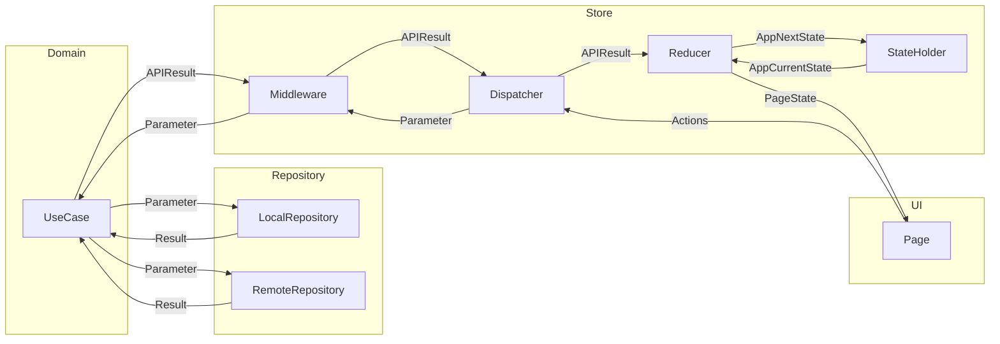
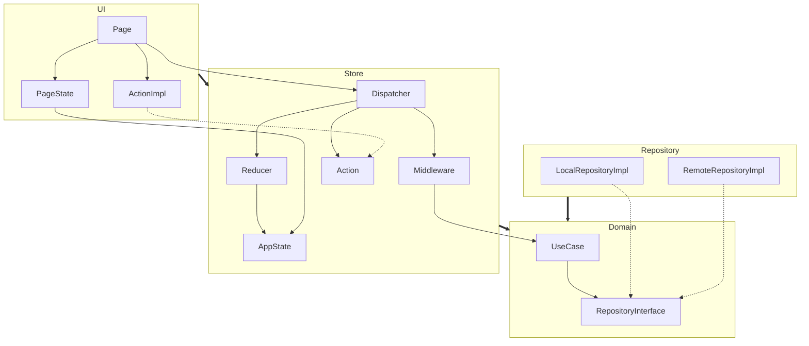

# flutter_redux_sample

Flutter Redux sample.

## Overview

This is my Flutter Sample with Redux Architecture.

Using [Punk API](https://punkapi.com/documentation/v2).

## Diagram

### DataFlows

### Dependencies

